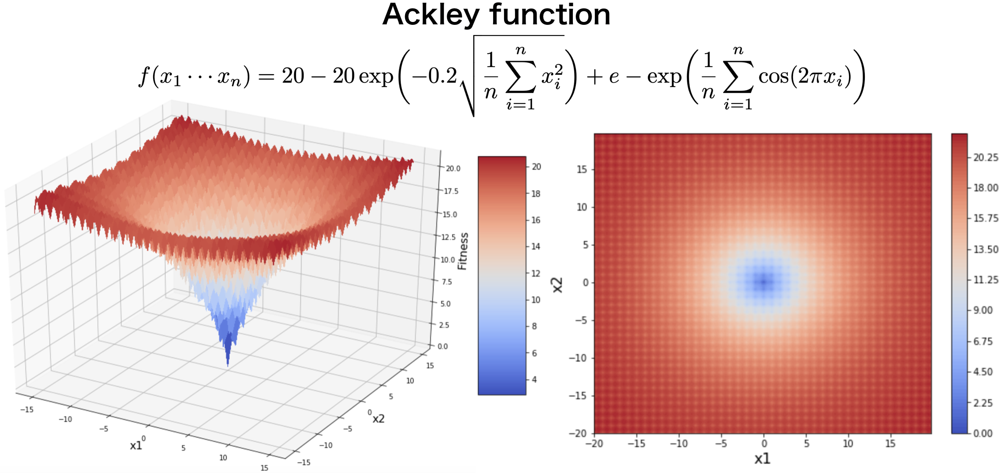

# eago

Evolutionary Algorithm implemented in Go

## Installation
```
$ go get github.com/tsurubee/eago
```

## Usage
### Genetic algorithm (GA)
The following example code attempts to minimize the Ackley function using GA.  
The Ackley function have a minimum value of 0 when variables(x1 and x2) is equal to 0.  


```go
package main

import (
    "github.com/tsurubee/eago"
    "log"
    "math"
)

type Variables []float64

func (V Variables) Initialization() eago.Genome {
    return Variables(eago.InitFloatVector(2, 32, -32))
}

func (V Variables) Fitness() float64 {
    return Ackley(V)
}

func (V Variables) Mutation() {
    eago.AddNormalFloat(V, 0.5)
}

func (V Variables) Crossover(X eago.Genome) eago.Genome {
    return Variables(eago.BLXalpha(V, X.(Variables), 0.3))
}

func Ackley(X []float64) float64 {
    a, b, c, d := 20.0, 0.2, 2*math.Pi, float64(len(X))
    var s1, s2 float64
    for _, x := range X {
        s1 += x * x
        s2 += math.Cos(c * x)
    }
    return -a*math.Exp(-b*math.Sqrt(s1/d)) - math.Exp(s2/d) + a + math.Exp(1)
}

func main() {
    var v Variables
    ga := eago.NewGA(eago.GAConfig{
        PopulationSize: 30,
        NGenerations:   20,
        CrossoverRate:  0.8,
        MutationRate:   0.01,
    })
    if err := ga.Minimize(v); err != nil {
        log.Fatal(err)
    }
}
```
If the above sample code is named as `main.go` and executed as follows, the result of parameter search is displayed on the standard output.    
```bash
$ go run main.go
Generation   1: Fitness=11.208 Solution=[-4.501 0.087]
Generation   2: Fitness=10.001 Solution=[-3.592 -0.833]
Generation   3: Fitness=9.165 Solution=[-3.841 -0.960]
Generation   4: Fitness=5.747 Solution=[-1.426 -0.235]
Generation   5: Fitness=4.258 Solution=[-0.824 0.380]
Generation   6: Fitness=2.797 Solution=[-0.843 -0.011]
Generation   7: Fitness=2.605 Solution=[-0.955 -0.030]
Generation   8: Fitness=2.605 Solution=[-0.955 -0.030]
Generation   9: Fitness=2.604 Solution=[-0.925 0.016]
Generation  10: Fitness=2.604 Solution=[-0.925 0.016]
Generation  11: Fitness=2.479 Solution=[-0.346 -0.054]
Generation  12: Fitness=1.216 Solution=[-0.184 -0.006]
Generation  13: Fitness=0.615 Solution=[-0.111 -0.001]
Generation  14: Fitness=0.501 Solution=[-0.096 -0.007]
Generation  15: Fitness=0.267 Solution=[-0.055 0.024]
Generation  16: Fitness=0.056 Solution=[0.010 -0.014]
Generation  17: Fitness=0.056 Solution=[0.010 -0.014]
Generation  18: Fitness=0.053 Solution=[-0.005 -0.015]
Generation  19: Fitness=0.031 Solution=[0.010 0.003]
Generation  20: Fitness=0.013 Solution=[-0.000 0.004]
```

### Particle swarm optimization (PSO)
```go
package main

import (
	"github.com/tsurubee/eago"
	"log"
)

func objectiveFunc(x []float64) float64 {
	return x[0] * x[0] + x[1] * x[1]
}

func main() {
	pso := eago.NewDefaultPSO()
	pso.NParticle =  5
	pso.NStep = 20
	pso.Min = -20
	pso.Max = 10

	if err := pso.Minimize(objectiveFunc, 2); err != nil {
		log.Fatal(err)
	}
}
```
If the above sample code is named as `main.go` and executed as follows, the result of parameter search is displayed on the standard output.    
```bash
$ go run main.go
Step   0: Fitness=8.124 Position=[-2.168 1.851]
Step   1: Fitness=8.124 Position=[-2.168 1.851]
Step   2: Fitness=7.394 Position=[-1.618 2.186]
Step   3: Fitness=6.958 Position=[1.068 2.412]
Step   4: Fitness=6.958 Position=[1.068 2.412]
Step   5: Fitness=4.809 Position=[-2.106 0.611]
Step   6: Fitness=2.215 Position=[-1.052 1.053]
Step   7: Fitness=1.535 Position=[0.580 1.095]
Step   8: Fitness=0.163 Position=[0.023 0.403]
Step   9: Fitness=0.163 Position=[0.023 0.403]
Step  10: Fitness=0.055 Position=[-0.175 0.156]
Step  11: Fitness=0.055 Position=[-0.175 0.156]
Step  12: Fitness=0.055 Position=[-0.175 0.156]
Step  13: Fitness=0.055 Position=[-0.175 0.156]
Step  14: Fitness=0.055 Position=[-0.175 0.156]
Step  15: Fitness=0.055 Position=[-0.175 0.156]
Step  16: Fitness=0.055 Position=[-0.180 0.151]
Step  17: Fitness=0.044 Position=[0.019 0.210]
Step  18: Fitness=0.013 Position=[-0.111 0.023]
Step  19: Fitness=0.008 Position=[-0.083 -0.031]
```

## Implemented algorithms

- Genetic algorithm

- Particle swarm optimization

## License

[MIT](https://github.com/tsurubee/eago/blob/master/LICENSE)

## Author

[tsurubee](https://github.com/tsurubee)